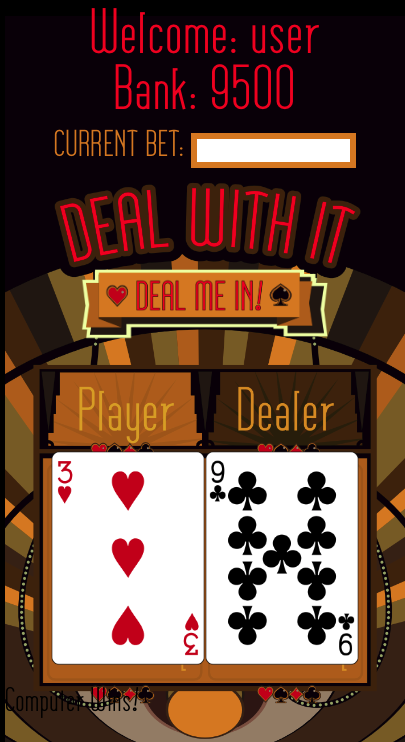

## DEAL WITH IT!
  

## ABOUT
Deal With It, by HighRollers Inc, is a betting card game where the user can bet on a hand of cards. The win of the bet is decided by who has the higher card the player or the computer. If the computer wins the user loses the amount they bet from their bank. If the user wins the bet their amount is doubled.
The game is suppose to be an easy and fun way to bet and watch your bank grow or fall to the nothing!

### TABLE OF CONTENTS
 * [About](#ABOUT)

 * [Usage](#USAGE)

 * [License](#LICENSE)

 * [Team](#TEAM)

 * [Questions](#QUESTIONS)
 
 * [Deployment](#DEPLOYMENT)

## USAGE
Just log in or create an account and play!

## LICENSE
Apache 2.0 License

## TEAM
Tony Lone Fight, Steven Langlois, Connor Carciofini, Elijah Gorden

## QUESTIONS
[CONNOR'S GITHUB](https://github.com/infinity-machine) - 
[STEVEN'S GITHUB](https://github.com/Steven-Lang99) - 
[TONY'S GITHUB](https://github.com/tonyCLD) - 
[ELIJAH'S GITHUB](https://github.com/elijhagordon000)

## DEPLOYMENT
[HEROKU](https://cjc-highrollers.herokuapp.com/)

